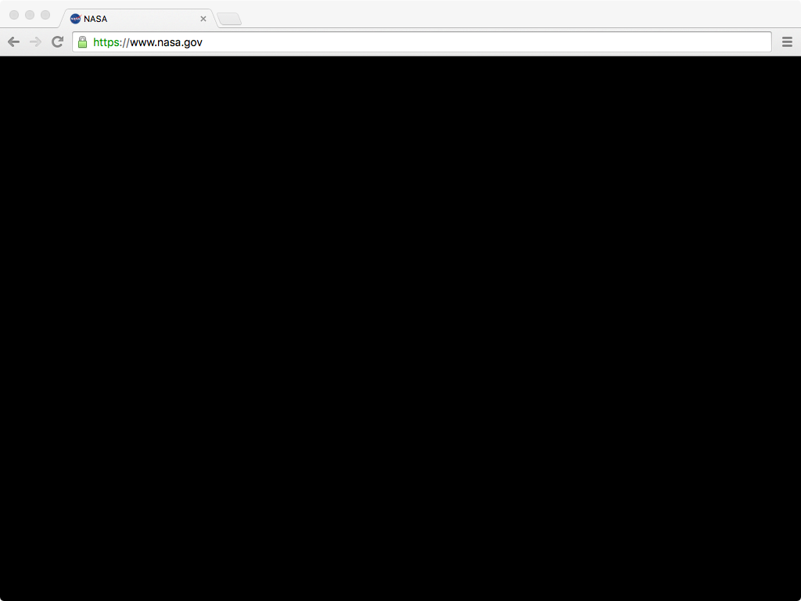

# Fyrirlestur 11.3 – Unobtrusive og eslint

## Vefforritun 1 — TÖL107G

### Ólafur Sverrir Kjartansson, [osk@hi.is](mailto:osk@hi.is)

---

## Villumeðhöndlun

* JavaScript hefur ekki eins villumeðhöndlun og HTML og CSS
* Ef eitthvað brotnar eru líkur á að það hafi áhrif á _allt_
* Verðum að hafa í huga

***

> Has the page loaded yet? Did the HTTP request for the JavaScript succeed? Did the HTTP request for the JavaScript complete? Does the corporate firewall block JavaScript? Does their ISP or mobile operator interfere with downloaded JavaScript? Have they switched off JavaScript? Do they have add‐ons or plug‐ins installed which inject script or alter the DOM in ways you didn’t anticipate? Is the Content Delivery Network up?
- [Everyone has JavaScript, right?](https://kryogenix.org/code/browser/everyonehasjs.html)

***

## Unobtrusive JavaScript

Alveg eins og við aðskiljum útlit frá efni viljum við aðskilja forrit frá efni.

Tengt progressive enhancement er hugtakið _unobtrusive JavaScript_.

* Aðskilnaður hegðunar frá markupi
* Sem minnst fótspor — ekki skilgreina í global scope
* Athuga hvort virkni sé studd og þá bæta henni við

***

* Bæta hegðun við og virka án hennar – ekki festa atburð við element
  - `<a href="..." class="enhance"` ~~onclick="handleClick()~~`">`
  - `document.querSelector('enhance'). addEventListener('click', handleClick)`

***

> 1\. Identify core functionality.
>
> 2\. Make that functionality available using the simplest possible technology.
>
> 3\. Enhance!

- [Resilient Web Design, chapter 6: Steps](https://resilientwebdesign.com/chapter6/)

***

> Some designers have misunderstood progressive enhancement to mean that all functionality must be provided to everyone. It’s the opposite. Progressive enhancement means providing core functionality to everyone. After that, it’s every browser for itself.
- [Resilient Web Design, chapter 5: Layers](https://resilientwebdesign.com/chapter5/)

***



***

## Verkefni

* Í verkefnum sem við leysum með JavaScript erum við stundum að setja upp efni _eftir_ að vefur hleðst inn
* Ef svona verkefni væru leyst í raunveruleikanum myndum við hafa _server-side rendering_
  - Höfum efni til staðar í HTML í byrjun—krefjumst ekki JavaScript

---

## JSLint

* Skrifað af Douglas Crockford til að leiðrétta villur í JS kóða
* Svipað og strict mode en einhver munur
* Mjög strangt og lítið hægt að breyta reglum
* Hægt að keyra á netinu: [jslint.com](http://jslint.com/)

***

## JSLint dæmi – villur

```javascript
function sum(a, b, c)
{
  return a + b + c;
}

sum(1, 2 , 3)
```

***

## JSLint dæmi – rétt

```javascript
function sum(a, b, c) {
    'use strict';
    return a + b + c;
}

sum(1, 2, 3);
```

***

## JSHint

* JSHint er _fork_ af JSLint með meiri möguleika á að sérsníða
* Hægt að keyra á netinu: [jshint.com](http://jshint.com/)
* Ekki nægilega vel sniðið að ES2015 og nýrri útgáfum

***

## eslint

* _Enn einn linterinn_ fyrir JavaScript
* Skrifaður með það í huga að vera almennur og bjóða upp á _plugins_
* Skilgreinum reglur í `.eslintrc` skrá í rót verkefnis
* Einn mest notaði JavaScript linter í dag og sá sem við munum nota

***

## eslint uppsetning

* Setjum upp `eslint` fyrir verkefni
  - `npm install eslint --save-dev`
* Notum `eslint --init` til að útbúa `.eslintrc` skrá (eða `.eslintrc.js`)
  - Þurfum að keyra með `./node_modules/.bin/eslint --init` ef `eslint` er ekki uppsett global

***

* Svörum spurningum um hvernig við viljum nota `eslint`
* Best að fylgja stöðlum
  - Við ætlum að fylgja [airbnb JavaScript Style Guide](https://github.com/airbnb/javascript)

***

```javascript
module.exports = {
  "extends": "airbnb-base"
};
```

***

## eslint uppsetning

* Búum til script í `package.json`
  - `"test": "eslint *.js **/*.js"`
  - Keyrum og skoðum allar .js skrár í rót _og öllum_ möppum
  - `npm test`

***

## Reglur stilltar

* Viljum láta eslint vita að við séum að vinna í vafra
  - Fáum ekki villur ef við vísum í `document` eða `window`
* Bætum við í `.eslintrc`
* Getum líka stillt sérstaklega [hverja reglu](https://eslint.org/docs/rules/) innan `rules`

***

```javascript
module.exports = {
  extends: 'airbnb-base',
  env: {
    browser: true
  },
  rules: {
    'no-console': ['error', {
      allow: ['info', 'warn', 'error']
    }],
  }
};
```

***

## Slökkt á reglum

* Getum slökkt á ákveðnum reglum
* Per skrá: `/* eslint-disable <regla> */`
* Per línu: `/* eslint-disable-line */`
* Þurfum stundum en ættum almennt að forðast, lögum villur frekar
